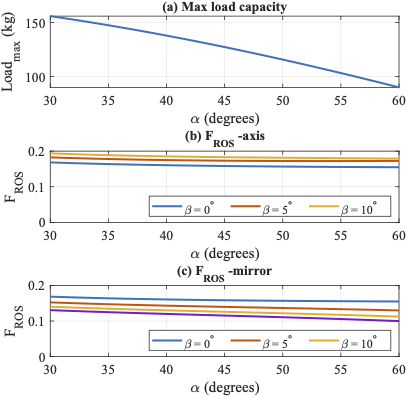
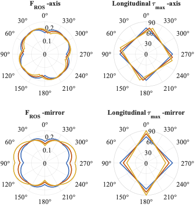
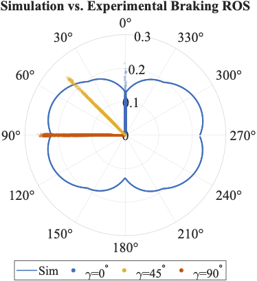

# Wheel-Position-Study: BallBot Wheel Configuration Simulation

## Project Overview
This repository contains a comprehensive suite of MATLAB and Simulink tools developed for the kinematic and dynamic simulation, design optimization, and control validation of a BallBot. Specifically, this study evaluates omniwheel placement ($\alpha$, $\beta$, and $\gamma$ angles), torque limits, and trajectory generation to support the development of the PURE (Personalized Unique Rolling Experience) Gen 3 platform at the Human Dynamics and Controls Lab (HDCL) at UIUC.

## Example figures:





## File Dependency & Execution Flow
The simulation workflow relies on core physical models generating data, which is then fed into optimization functions and ultimately visualized. 

```text
[trajectory_optimization.m] ──> (saves traj_1.mat) ──┐
                                                     v
[rotation_matrix.m] ──────────> [ros_calculation.m] ─┤
    │                                                │
    │                                                v
    │                               [motor_config_optimization.m]
    │                                                │
    │                                                │ 
    │                                                v
    │                                        (saves ros_map.mat)
    │                         ┌──────────────────────┴───────────────┐
    │                         │                                      │
    │                         v                                      v
    │            [directional_performance.m]         [design_optimization.m]
    │                                                                ^
    ├──> [spin_torque_constrain.m] ──────> (saves rotation_map.mat) ─┤
    ├──> [traslation_torque_constrain.m] ──> (saves torque_map.mat) ─┤
    └──> [traslation_speed_constrain.m] ────────> (saves v_map.mat) ─┤

(Plotting Scripts load .mat files) ──> [alpha_impact_figure.m, directional_figure.m, etc.]

[validation_data_process.m] ──> (saves processed_results.mat) ──> [validation_figure.m]
```
